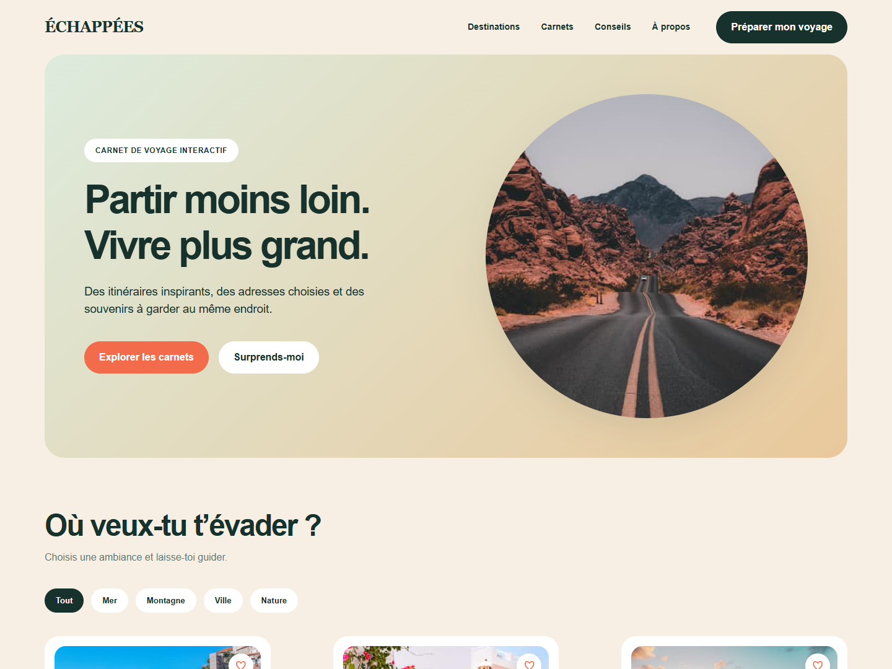
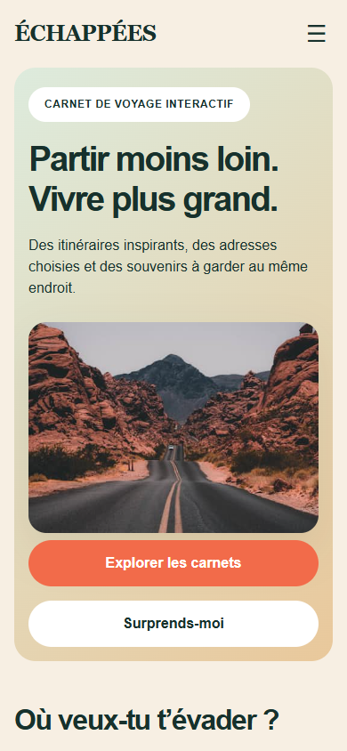
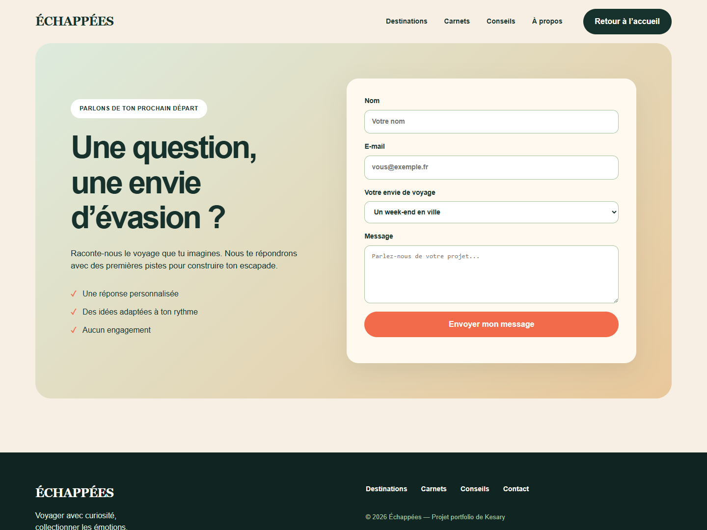
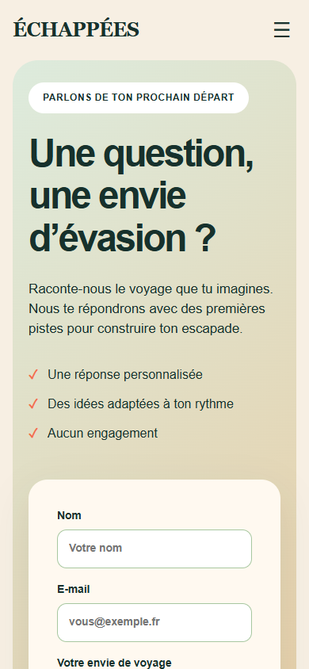
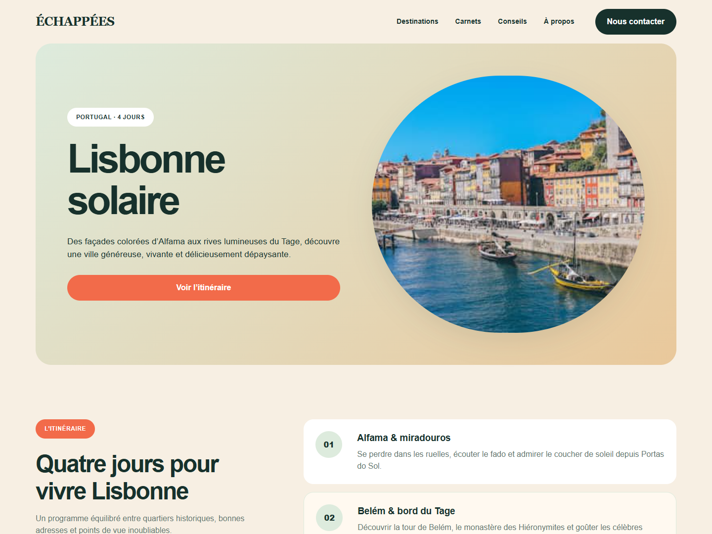
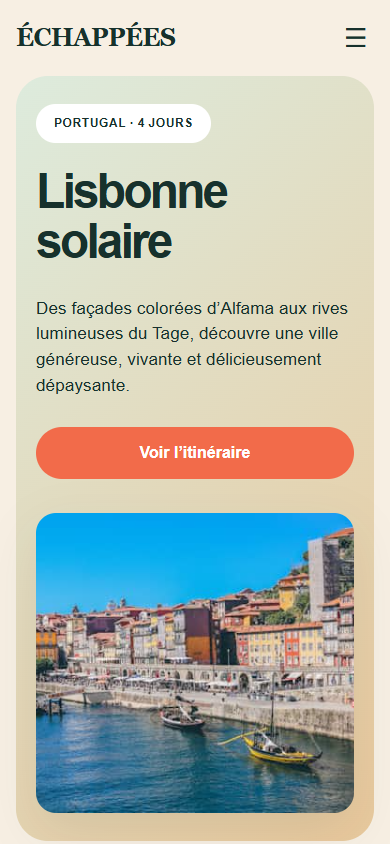

# Échappées

Maquette responsive d’un carnet de voyage, réalisée en HTML, CSS/LESS et JavaScript.

## Site en ligne

[Découvrir Échappées](https://kesary-p.github.io/echappees-voyage/)

## Pages

- Accueil : `index.html`
- Contact : `contact/index.html`
- Lisbonne solaire : `Lisbonne/index.html`
- Planche des maquettes PC et mobile : `maquettes/index.html`

La planche présente les trois pages aux formats de référence 1440 × 1080 px et 390 × 844 px.

## Maquettes Figma

Les écrans de référence sont présentés en versions desktop (1440 × 1080 px) et mobile (390 × 844 px).

### Accueil

| Desktop | Mobile |
| --- | --- |
|  |  |

### Contact

| Desktop | Mobile |
| --- | --- |
|  |  |

### Lisbonne Solaire

| Desktop | Mobile |
| --- | --- |
|  |  |

## Lancer le projet

Le site est statique. Il peut être ouvert directement dans un navigateur ou servi par un serveur HTTP local.

Pour reconstruire la feuille CSS après une modification de `styles.less` :

```sh
npm install
npm run build:css
```
